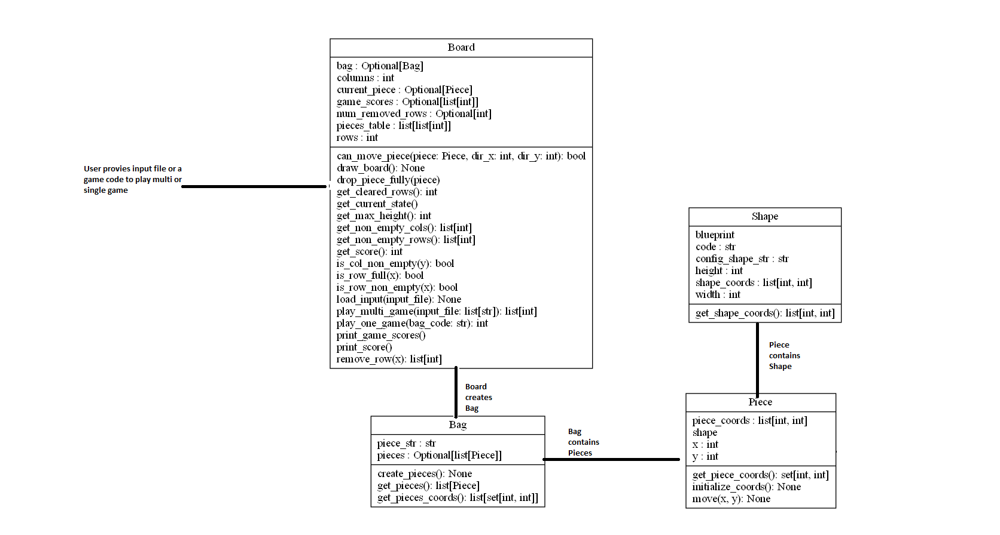

# Tetris
Tetris with simplified rules

The game assumes that a piece enter from top location and drops down fully,
without any option to move piece horizontally 

Rules of the game are:

- Each piece is made up of four unit squares. 
- No two unit squares can occupy the same space in the grid at the same time. 
- The pieces are rigid, and come to rest as soon as any part of a piece contacts the
bottom of the grid or any resting block. 
- Whenever an entire row of the grid is filled, it disappears, and any higher rows drop into the vacated space without
any change to the internal pattern of blocks in any row.

Game is scored based on maximum column height left at the end of game.

Design of the game is shown in the chart below. 

Board includes the grid that holds pieces and plays a game from a Bag. 

Bag represents a list of pieces to be played together

Piece is basic element of the game, with coordinates and a shape

Possible shapes in the game are (Q, Z, S, T, I, L, J). It can be overwritten 
in configuration of the game (under ./conf/conf.json)  

A game code is a list of two character strings, that represents shape 
and horizontal location of each piece (e.g. T1,Z3,I4)

## Project Structure

Details of each folder is explained below:

- src: contains main code
- tests: test suite to test functionality of each class
- conf: configuration file to contain information about shapes and board
- dist: location of distribution build zip file
- input: location of sample input file
- Main folder contains setup.py and tetris.py files for setting up and running game. 
Also, it contains bash files (tetris, tetris_single and run_tests which are explained below)

## Installation requirements

Game was built in Python 3.9. 

Only standard Python libraries are used as follows:

- unittest
- json
- dataclasses
- typing

## How to run game
### From STDIN

`./tetris < input/input.txt > output.txt`

### For a single game code

Output is maximum height among columns

`./tetris_single T1,Z3,I4`

## How to run tests

All tests run OK. Expected failures in tests are asserted

`./run_tests.sh`

## How to create distribution build
 
 It creates zip file for distributing game under ./dist folder

`python setup.py bdist`

